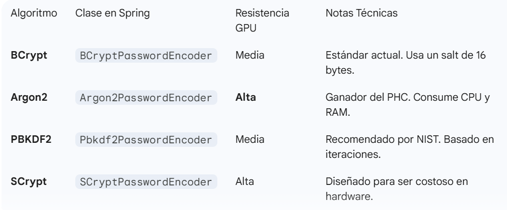
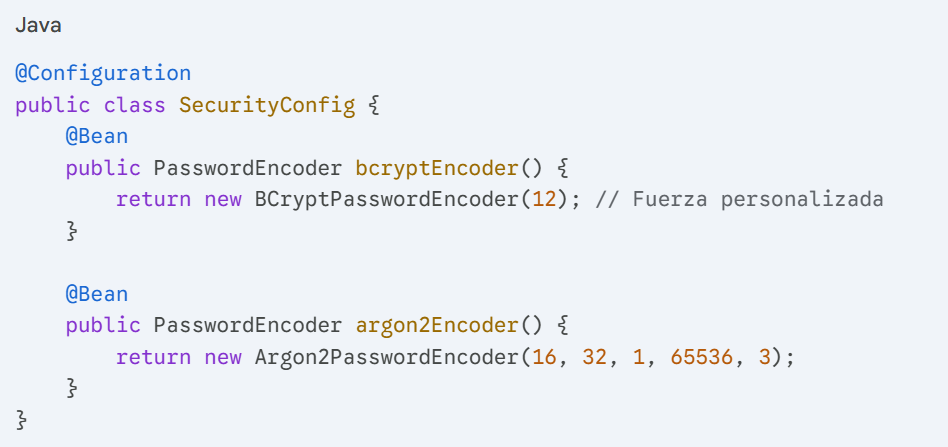
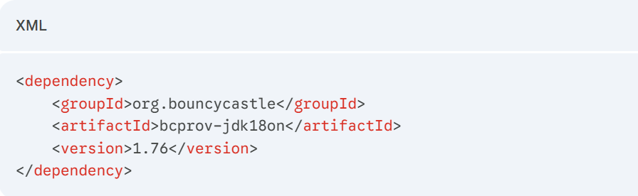
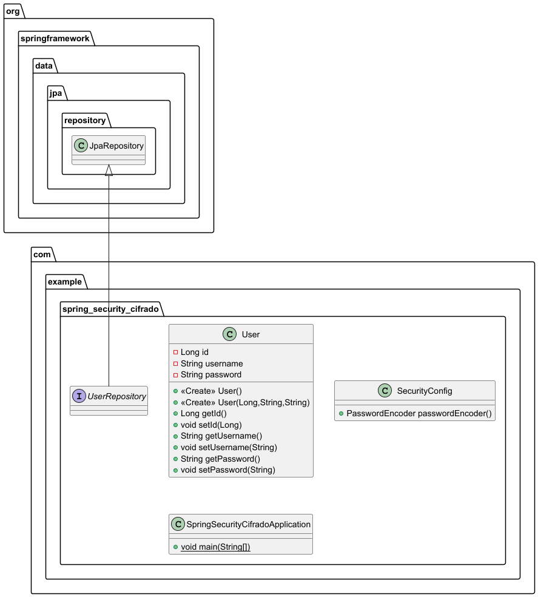

**_Spring Boot Crypto Lab:_** A technical deep-dive into Spring Security PasswordEncoders. Featuring a comparative analysis of BCrypt, Argon2, PBKDF2, and SCrypt with PostgreSQL persistence and automated benchmarking using CommandLineRunner.

**Spring Security Password Encoding Study:** Implementing and benchmarking adaptive hashing algorithms (BCrypt, Argon2, SCrypt) in Spring Boot 3 with JPA/PostgreSQL integration.

**🔐 Spring Boot Crypto Lab**
Este proyecto es un laboratorio técnico desarrollado para estudiar, implementar y comparar los diferentes mecanismos de cifrado de contraseñas (PasswordEncoders) proporcionados por Spring Security 6. El objetivo es analizar el balance (trade-off) entre seguridad criptográfica y rendimiento computacional.

# 🔐 Sistemas de Cifrado en Spring Boot
Curso Spring – Ob

Este proyecto demuestra cómo **gestionar y almacenar contraseñas de forma segura** en aplicaciones Spring Boot utilizando **Spring Security**, **PasswordEncoders**, **PostgreSQL** y **JPA**.  
Se analizan y prueban distintos algoritmos de cifrado modernos, sus configuraciones y sus implicaciones en rendimiento y seguridad.

---

## 📌 Objetivo del Proyecto

- Comprender la **importancia del cifrado de contraseñas**
- Aplicar **funciones hash seguras** con salt y factores de trabajo
- Comparar algoritmos de cifrado modernos
- Persistir usuarios con contraseñas cifradas en **PostgreSQL**
- Aplicar buenas prácticas de **arquitectura y refactorización en Spring Boot**

---

## 🧠 Conceptos Clave de Seguridad

### ¿Por qué cifrar contraseñas?
El cifrado convierte una contraseña en texto plano en un valor irreconocible mediante funciones hash.  
Esto evita que, incluso si la base de datos es comprometida, las contraseñas reales puedan ser obtenidas fácilmente.

### Salt y Factor de Trabajo
- **Salt**: valor aleatorio único por contraseña, evita ataques por tablas rainbow.
- **Factor de trabajo / iteraciones**: incrementa el costo computacional del hash.
- **Trade-off**: más seguridad implica mayor consumo de CPU y tiempo de validación.

---

## 🛠️ Tecnologías Utilizadas

- Java 17+
- Spring Boot
- Spring Security (Crypto)
- Spring Data JPA
- PostgreSQL
- Hibernate
- JUnit 5
- pgAdmin
- Bouncy Castle (para Argon2)

---
🏗️ Algoritmos de Cifrado Estudiados
En este laboratorio analizamos cómo cada algoritmo utiliza un Salt (salt) único para evitar ataques de diccionario y cómo el factor de trabajo dificulta la fuerza bruta.

**## Cifrado**

Es el proceso de codificar la información de su representación original (texto plano)
a texto cifrado, de manera que solamente pueda ser descifrado utilizando una clave.

1. Almacenar contraseñas en texto plano (Vulnerable a hackers)
2. Almacenar contraseñas cifradas con una función hash
3. Almacenar contraseñas cifradas con una función hash + salt
4. Almacenar contraseñas cifradas con una función adaptativa + factor de trabajo

La seguridad se gana haciendo que la validación de contraseñas sea costosa computacionalmente.

## Algoritmos en Spring Security

* **BCrypt**
* **PBKDF2**
* **scrypt**
* **argon2**

🔑 Algoritmos de Cifrado Analizados

**✅ BCrypt (Recomendado por defecto)**

Genera automáticamente un salt de 16 bytes

Hash de 60 caracteres

Incluye versión, fuerza y salt en el resultado

Fuerza por defecto: 10 (rango 4–31)

Ejemplo de formato:

$2a$10$<22-char-salt><hash>

**✅ PBKDF2**

Función adaptativa recomendada por OWASP.

Parámetros clave:

Secret (Pepper): clave global (no se guarda en BD)

Salt Length: 16 bytes

Iterations: 310,000

Algorithm: PBKDF2WithHmacSHA256

🔎 Ideal cuando se requiere compatibilidad y control fino del costo.

**🏆 Argon2 (Estado del Arte)**

Ganador del Password Hashing Competition.

Ventajas:

Consume CPU + RAM

Resistente a ataques con GPU y ASICs

Configuración típica:

new Argon2PasswordEncoder(16, 32, 1, 65536, 3);

⚠️ Muy seguro pero pesado: usar con cuidado en bucles y CI/CD.

**🔒 SCrypt**

Diseñado para ser costoso en hardware.

Uso estimado de memoria:

Memoria ≈ 128 × N × r × p

Configuración recomendada:

N: 16384

r: 8

p: 1

Memoria ≈ 16 MB por login

## **🔄 DelegatingPasswordEncoder**

Permite delegar el cifrado a distintos algoritmos sin acoplar la aplicación a uno solo.

**Ventajas:**

Facilita migraciones

Soporta múltiples algoritmos

Evita refactorizaciones masivas

Ejemplo:

PasswordEncoder encoder = new DelegatingPasswordEncoder("bcrypt", encoders);

**🧪 Pruebas con JUnit**

Se implementaron tests para:

Verificar que el mismo password genera hashes distintos

Validar .matches()

Comparar rendimiento y formato entre algoritmos

**📌 Un test sin asserts no es un test.**

**🧱 Persistencia con PostgreSQL**
Entidad User

@Entity
@Table(name = "app_user")
public class User {
@Id
@GeneratedValue(strategy = GenerationType.IDENTITY)
private Long id;
private String username;
private String password;
}

Configuración application.properties

spring.datasource.url=jdbc:postgresql://localhost:5432/springpostgre
spring.datasource.username=postgres
spring.datasource.password=admin
spring.jpa.hibernate.ddl-auto=create-drop
spring.jpa.show-sql=true
spring.jpa.properties.hibernate.dialect=org.hibernate.dialect.PostgreSQLDialect

**🔐 Configuración de Seguridad**

Siguiendo el Principio de Responsabilidad Única, el PasswordEncoder se define en una clase dedicada,
definiendo uno de los @Bean como @Primary **con lo cual le indicamos al componenScaning que utilice este principalmente**

@Configuration
public class SecurityConfig {
    
    @Bean
    Primary
    public PasswordEncoder bcryptEncoder() {
        return new BCryptPasswordEncoder();
    }

    @Bean
    public PasswordEncoder argon2Encoder() {
        return new Argon2PasswordEncoder(16, 32, 1, 65536, 3);
    }
}

🚀 CommandLineRunner (Buenas Prácticas)

**Se utiliza para:**

**Poblar la base de datos**

**Comparar algoritmos**

**Ejecutar pruebas automáticas al arrancar**

**Ventajas:**

**Código limpio**

**Inyección automática de dependencias**

Sin uso manual de ApplicationContext

**📊 Resultados Observados**

Contraseñas iguales → hashes distintos

**BCrypt:** rápido y balanceado

**Argon2:** máximo nivel de seguridad

**SCrypt:** alto consumo de memoria

**DelegatingPasswordEncoder:** flexibilidad futura

✅ **Conclusiones**

Nunca almacenar contraseñas en texto plano

Preferir algoritmos adaptativos

Ajustar seguridad según contexto (banco ≠ web simple)

Spring Security ofrece herramientas robustas y extensibles

La arquitectura limpia facilita mantenimiento y evolución

📚 **Referencias**

Documentación oficial de Spring Security

OWASP Password Storage Cheat Sheet

Password Hashing Competition (PHC)

🛠️ **Arquitectura de Configuración**
Para mantener el código limpio y profesional (siguiendo el principio de responsabilidad única), los Beans se han separado de la clase principal:

Configuración de Beans (SecurityConfig.java)
Se definen los encoders de forma modular para que Spring los mapee automáticamente en el contexto.

**Inicialización de Datos (CommandLineRunner)**
Utilizamos un CommandLineRunner para ejecutar pruebas de cifrado automáticamente al arrancar la aplicación, inyectando los componentes necesarios sin necesidad de buscarlos manualmente en el contexto.

📊 **Análisis de Resultados (Insights)**
Identificación del Hash: Cada algoritmo genera un prefijo identificador (ej: $2a$ para BCrypt, $argon2id$ para Argon2).

**Seguridad Adaptativa:** Aumentar el "costo" (iteraciones o memoria) hace que el login sea más lento pero protege mejor ante filtraciones de la base de datos.

**Salting Automático:** Aunque dos usuarios usen la misma contraseña (ej: "admin"), el resultado en PostgreSQL será siempre diferente gracias al salt aleatorio generado por Spring Security.

⚙️ **Configuración del Entorno**
**Base de Datos**
Configura tu instancia de PostgreSQL en src/main/resources/application.properties:

Dependencia necesaria para Argon2

🧪 Cómo ejecutar las pruebas
Clona el repositorio.

Tener PostgreSQL corriendo.

Ejecuta ./mvnw spring-boot:run.

Observa la consola para ver los Benchmarks de los diferentes Encoders generados por el CommandLineRunner.

| **Salt** | Valor aleatorio por usuario. | Una llave única para cada usuario. |
| **Pepper** | Secreto global en el servidor. | Una cerradura maestra. |
| **Work Factor** | Esfuerzo de CPU necesario. | La resistencia de un algoritmo para ser descifrado. |

